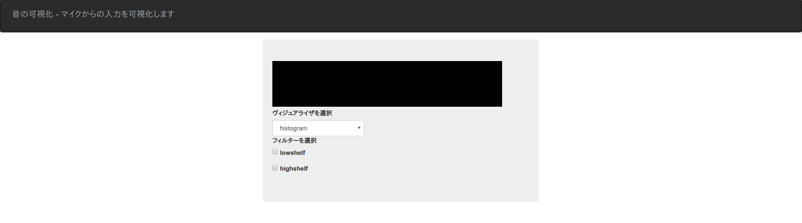
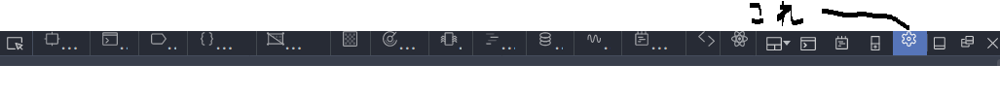
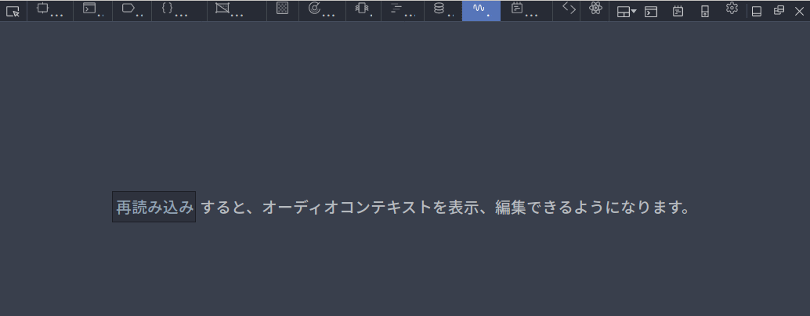
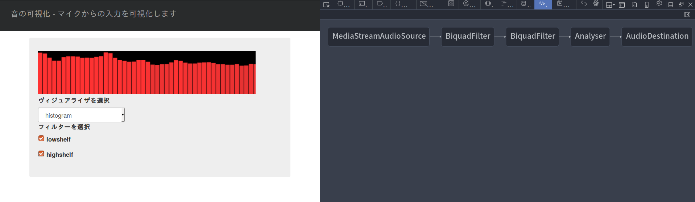
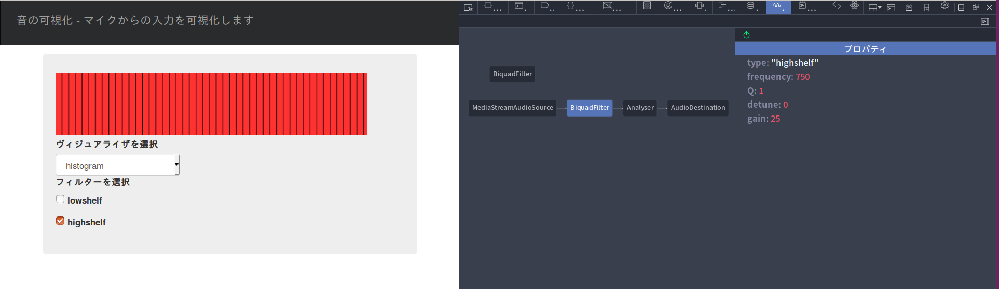
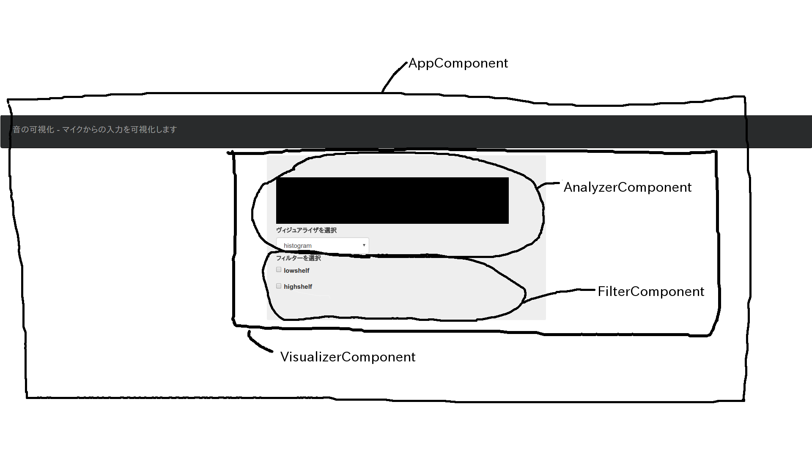
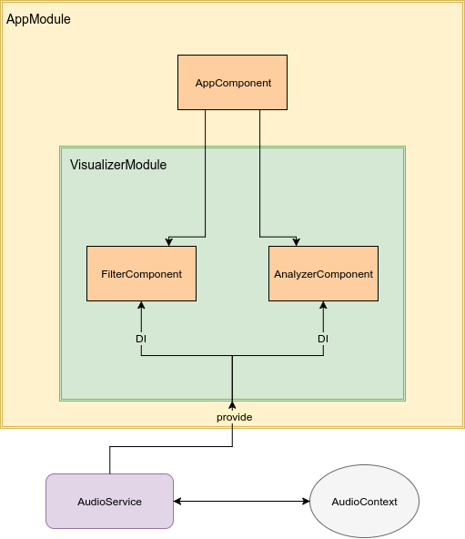
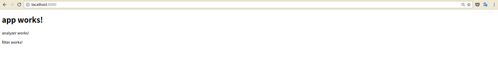

# 環境構築

開発に必要なソフトをインストールしていきましょう。以下のソフトウェアをインストールして下さい。

- [Visual Studio Code](https://code.visualstudio.com/)
- [Firefox](https://www.mozilla.org/ja/firefox/new/)
- Node.js, nodebrew(nodist)
  - [Windows(Node.js)](http://qiita.com/okamoai/items/a875b26abab7f18da7d1)
    - [Windows(nodist)](http://albatrosary.hateblo.jp/entry/2016/02/08/115305)
  - [Mac, Linux(Node.js + nodebrew)](http://qiita.com/oreo3@github/items/622fd6a09d5c1593fee4)
  - **今回はNode.js v7.8.0(npm 4.2.0)を使います**
- [angular-cli](https://github.com/angular/angular-cli)

# はじめに

## 今日やること

このワークショップでは、音を加工したり可視化したりするSPAをつくります！イェーイ！

前半はみんなで足並みを揃えて同じアプリケーション([MDNのVoice-change-O-matic](https://mdn.github.io/voice-change-o-matic/)を参考にしました。解説記事は[こちら](https://developer.mozilla.org/ja/docs/Web/API/Web_Audio_API/Using_Web_Audio_API#Canvas%E3%82%92%E5%88%A9%E7%94%A8%E3%81%97%E3%81%9F%E7%B0%A1%E5%8D%98%E3%81%AA%E5%8F%AF%E8%A6%96%E5%8C%96))を作り、後半は各々好きなアプリケーションを作ってもらおうと思います。

(MDNはMozillaの貢献者たちによる著作物であり、[CC-BY-SA 2.5](http://creativecommons.org/licenses/by-sa/2.5/)の下でライセンスされています。)

## デモ作品をさわってみる

まず、前半で作るアプリケーションの完成形を動かしてみましょう。

このリポジトリのrootに移動して、

```npm iをnstall && ng serve```

を入力して下さい。```localhost:8080```でWebサーバが立ち上がっているはずなので、ブラウザでアクセスしてみてください。



こんな感じのサウンドヴィジュアライザが出てくると思います。ヴィジュアライザと言いつつ音が出るので注意してください。

このアプリケーションはWeb Audio APIを利用しています。Web Audio APIとは何でしょうか。

# Web Audio APIについて

## Web Audio APIとは

その説明は他の資料が詳しいのでご覧ください。

- [Getting Started with Web Audio API - HTML5 Rocks](https://www.html5rocks.com/ja/tutorials/webaudio/intro/)

- [Web Audio API - Web API インターフェイス | MDN](https://developer.mozilla.org/ja/docs/Web/API/Web_Audio_API)

MDNの説明を借りると、

>　Web Audio APIはWeb上で音声を扱うための強力で多機能なシステムを提供します。これにより開発者はオーディオソースを選択したり、エフェクトを加えたり、ビジュアライゼーションを加えたり、パンニングなどの特殊効果を適用したり、他にもたくさんのいろいろなことができるようになります。

## Web Audio APIの概念と利用方法

こちらも[MDN](http://creativecommons.org/licenses/by-sa/2.5/)から引用します。

> Web Audio API は音声操作をオーディオコンテキスト内の操作として実現し、モジュラールーティングできるようにデザインされています。基本的な操作は オーディオノードとして表現されています。これを接続することで、オーディオグラフを作成します。 チャンネル構成の異なる複数の音源も 1 つのコンテキスト内で扱えます。この構成によって、複雑で動的な音声操作を実現できるようになっています。

> オーディオノードは入力と出力を接続され、一つや多数のソースからいくつかのノードを辿ってdestinationに到達するチェインを形成します。(音声の可視化を行う場合など、 destination へは到達しないこともあります) 通常のWeb Audioの使い方は次のようになります:

>> 1. オーディオコンテキストを作成する>
>> 2. コンテキストの中で、<audio>,オシレーター,ストリームなどのソースを作成する
>> 3. リバーブ・フィルター・パンナー・コンプレッサーなどのエフェクトノードを作成する
>> 4. 最終的な音声の到達先を選ぶ(例えばスピーカー)
>> 5. ソースをエフェクトに繋げ、エフェクトを到達先(destination)に繋げる

>> 

> タイミングは高精度で低遅延に制御されます。正確にイベントに反応したり特定の音声サンプルにアクセスしたりすることができます。ドラムマシンやシーケンサーのようなアプリケーションを作ることができます。

> Web Audio API は立体音響も扱えます。 source-listener モデル に基づいたシステムを利用し、パンニングモデルをコントロールできます。また距離に基づく音の減衰や、ドップラー効果も扱えます。

前半で作るアプリケーションで、AudioContextがどのように変化していくかを確認してみましょう。Firefoxの開発者ツールに[Web Audioエディタ](https://developer.mozilla.org/ja/docs/Tools/Web_Audio_Editor)があるので、それを使ってみます。

完成形のアプリケーションにFirefoxからアクセスし、```F12```を押して開発者ツールを開いて下さい。開いたら、Web Audioエディタのタブを追加するために歯車のタブをクリックします。



標準の開発者ツール -> Web Audioにチェックを付けてください。こんな感じのツールが表示されるようになります。



以下はマイクからのAudioSourceに２つのフィルタを繋いだ時のAudioContextの状態です。



フィルタのノードをクリックすると、プロパティを確認・編集できます。



先のMDNにおける解説でいうところの```inputs```, ```effects```, ```Destination```との対応は以下の通りです。

| Nodeのタイプ  |                 内容                 |
|:------------|:------------------------------------|
| inputs      |MediaStreamAudioSource(マイク入力)     |
| effects     |BiquadFilter, Analyzer(可視化,音の加工)|
| Destination |AudioDestination(スピーカ出力)          |

このアプリケーションがWeb Audio APIをどう利用しているかがわかったかと思います。

# ヴィジュアライザをつくる

お待たせしました、ヴィジュアライザを作っていきましょう。

開発はangular-cliを使って進めていきます。まずAngularとangular-cliについて、ヴィジュアライザアプリでの役割と対応付けながら説明していきます。

## Angularについて

はじめにangular-cliをインストールしてもらいましたが、Angularというのはコンポーネント指向のWebアプリケーションフレームワークです。SPAを作るのに色々と便利なので使います。

angular-cliはAngularをさくさく使えるようにするツールです。

Angular, angular-cliについての詳細は、Web Audio API同様他の資料を参考にしてください。

- [Architecture Overview - ts - GUIDE](https://angular.io/docs/ts/latest/guide/architecture.html)

- [CLI Quickstart - ts - CLI-QUICKSTART](https://angular.io/docs/ts/latest/cli-quickstart.html)

ここでは駆け足で、開発に使う機能をいくつか紹介します。

### Component

[AngularのComponent](https://angular.io/docs/ts/latest/cookbook/component-communication.html)(以降は単にComponentと呼びます)は、あるView(Template)に紐付いたControllerです。

以下のように宣言します。

```ts
import { Component, Inject } from '@angular/core';

// @はTypeScriptのDecoratorsです。AngularではTypeScriptの使用が推奨されています。
// 以降何度か見かけますが、angular-cliを使っていればこういったコードは自動生成されます。
@Component({
  selector: 'app-root',
  templateUrl: './app.component.html',
  styleUrls: ['./app.component.css']
})

export class AppComponent {
  private title: string = '音の可視化';
}
```

Componentは双方向・片方向のプロパティバインディングや、Viewからのイベントバインディングを実現するために存在します。具体的には、

- データストアにあるユーザのデータを表示する(ストアから持ってくるのはComponentの役割ではありません),
- Viewでクリックされたチェックボックスが何かを状態として持っておく

などの役割があります。

今回は以下のようにComponentを構成します。



### Service

[Service](https://angular.io/docs/ts/latest/tutorial/toh-pt4.html)は、特定のComponentから独立した仕事をするClassです。 i.e.) APIリクエスト, 数値計算

先ほど"データをデータストアから持ってくるのはComponentの役割ではない"と書きましたが、これはServiceが担う役割です。例えば、外部のリソースからユーザ一覧を取得するServiceは以下のようになります。

```ts
import { Injectable }    from '@angular/core';
import { Headers, Http } from '@angular/http';

import 'rxjs/add/operator/toPromise'; // rxjsはPromiseよりいい感じに非同期処理を書けます

import { User } from './user'; // ./userにはUserクラスが定義されています

// TypeScriptのDecorators(早速再登場)
@Injectable() 
export class UserService {

  private headers = new Headers({'Content-Type': 'application/json'});
  private const heroesUrl = 'api/urls';  // URL to web api

  // Serviceはこのように、constructorの引数に渡して使います
  // DI(依存性注入)の手法です
  constructor(private http: Http) { }

  getUsers(): Promise<User[]> {
    // API Responseのペイロードはjsonで返ってくるとします
    return this.http.get(this.heroesUrl)
               .toPromise() // Observable -> Promise
               .then(response => response.json().data as User[])
               .catch(this.handleError);
  }
}
```

Serviceは必要とされるComponentにDIをして使っていきます。DIは柔軟な設計やユニットテストのために、Classなどの塊同士を疎結合にするための手法です。ここでのDIは、あるComponentが依存しているServiceやClassなどを、そのComponentの内部で使えるように宣言するということです。

上記のコードではHttpクラスをconstructor()の引数に渡しています。こういった使われ方を想定する場合、classに```@Injectable()```というデコレータをつけてあげる必要があります。(付けないとトランスパイル時にエラーになります。)

今回のアプリケーションでは、Web Audio APIのAudio Contextとやり取りするServiceが必要です。

### Module

[Module](https://angular.io/docs/ts/latest/guide/ngmodule.html)は、Component, Service, 関数, 定数などをまとめたものです。Angularが提供するModuleとしてHttpModule, BrowserModuleなどがあります。HttpModuleならHTTP GET, HTTP SETのための関数や、Status Codeなどが定義されているわけです。

ミニマムなエントリモジュールは以下のようになります。

```ts
import { NgModule }      from '@angular/core';
import { BrowserModule } from '@angular/platform-browser';
import { AppComponent }  from './app.component';

@NgModule({
  imports:      [ BrowserModule ],
  declarations: [ AppComponent ],
  bootstrap:    [ AppComponent ]
})
export class AppModule { }
```

今回はVisualizerModuleのような、Visualizer関連のComponent, Serviceをまとめるとよさそうです。

## アーキテクチャを考える

ここまでAngularの一部の機能と、それらの今回のアプリケーションでの役割を紹介しました。図にまとめると以下のようになります。



これを実装していきましょう。

## スケルトンをつくる

まず、アプリケーションの骨組みを作っていきます。どこかに新しく作業用ディレクトリを作成し、そこへ移動してください。(この作業用ディレクトリのパスを以後```$WORK```とします。適時読み替えてください。)

angular-cliのプロジェクトを新規作成し、Module, Component, Serviceを追加します。

```sh
ng new SoundVisualizer --ng4
cd SoundVisualizer
ng g module visualizer && cd ./src/app/visualizer
ng g component filter
ng g component analyzer
cd ..
ng g service audio
```

```$WORK/SoundVisualizer/src/app```以下のディレクトリ構成は以下のようになるはずです。

```
$ tree $WORK/SoundVisualizer/src/app
$WORK/SoundVisualizer/src/app
├── app.component.css
├── app.component.html
├── app.component.spec.ts
├── app.component.ts
├── app.module.ts
├── audio.service.spec.ts
├── audio.service.ts
└── visualizer
    ├── analyzer
    │   ├── analyzer.component.css
    │   ├── analyzer.component.html
    │   ├── analyzer.component.spec.ts
    │   └── analyzer.component.ts
    ├── filter
    │   ├── filter.component.css
    │   ├── filter.component.html
    │   ├── filter.component.spec.ts
    │   └── filter.component.ts
    └── visualizer.module.ts

3 directories, 16 files
```

念の為、正しく起動するか確認しておきましょう。

```ng serve```

を入力し、ブラウザからアクセスしてみてください。```app works!```と表示されていればokです。

## モジュール・コンポーネント間の依存関係を設定する

今作成したモジュール・コンポーネントの関係を、先ほどの図にしたがって記述します。

まず、VisualizerModuleの依存関係を設定しておきます。```visualizer.module.ts```を以下のようにしてください。

```ts
import { NgModule } from '@angular/core';
import { CommonModule } from '@angular/common';
import { FormsModule } from '@angular/forms';

import { FilterComponent } from './filter/filter.component';
import { AnalyzerComponent } from './analyzer/analyzer.component';

import { AudioService } from '../audio.service';

@NgModule({
  imports: [
    CommonModule,
    FormsModule
  ],
  declarations: [
    FilterComponent, 
    AnalyzerComponent
  ],
  exports: [
    FilterComponent,
    AnalyzerComponent,
  ],
  providers: [
    AudioService
  ]
})
export class VisualizerModule { }
```

VisualizerModuleのComponentからAudioServiceを呼び出したり、逆にVisualizerModuleのComponentをよそから使えるようになりました。

次に、app.module.tsに以下を記述してください。

```ts
import { BrowserModule } from '@angular/platform-browser';
import { NgModule } from '@angular/core';
import { FormsModule } from '@angular/forms';

import { AppComponent } from './app.component';
import { VisualizerModule  } from './visualizer/visualizer.module';

@NgModule({
  declarations: [
    AppComponent
  ],
  imports: [
    BrowserModule,
    FormsModule,
    VisualizerModule
  ],
  providers: [],
  bootstrap: [AppComponent]
})
export class AppModule { }
```

これでVisualizerModuleのComponent等をAppModuleから呼び出せるようになります。VisualizerModuleのComponentはapp.component.htmlから呼び出します。app.component.htmlに以下を記述してください。

```html
<h1>{{title}}</h1>
<app-analyzer></app-analyzer>
<app-filter></app-filter>
```

先ほど```ng serve```を実行したため、webpackによってコードの変更は自動で反映されます。以下のようになっていればokです。AppComponentからVisuzlizerModuleのCoponent群を呼び出せています。



## (bootstrap)([コーナーで差をつけろ](https://twitter.com/laco0416/status/825711712774950913))

bootstrapを使えるように設定します。まずは必要なパッケージをインストールします。

``` npm install bootstrap ng2-bootstrap jquery ```

次に、angular-cli.jsonの21行目あたりからを以下のように編集します。

```json
"styles": [
  "styles.css",
  "../node_modules/bootstrap/dist/css/bootstrap.min.css"
],
"scripts": [
  "../node_modules/jquery/dist/jquery.min.js",
  "../node_modules/bootstrap/dist/js/bootstrap.min.js"
],
...
```

そしてapp.module.tsを以下のようにすれば、app.component.tsとそこから呼び出されるComponentのテンプレートにはbootstrapが使えます。

```ts
import { BrowserModule } from '@angular/platform-browser';
import { NgModule } from '@angular/core';
import { FormsModule } from '@angular/forms';

import { AppComponent } from './app.component';
import { VisualizerModule  } from './visualizer/visualizer.module';

import { Ng2BootstrapModule } from 'ng2-bootstrap';

@NgModule({
  declarations: [
    AppComponent
  ],
  imports: [
    BrowserModule,
    FormsModule,
    VisualizerModule,
    Ng2BootstrapModule.forRoot()
  ],
  providers: [],
  bootstrap: [AppComponent]
})
export class AppModule { }
```

## AudioService

ようやくちゃんとした(?)コードを書き始めます。何から始めればよいでしょうか？

先に書いた通り、ServiceはどのComponentからも独立しているため、ここから書き始めるのがよさそうです。```audio.service.ts```に以下を記述してください。

```ts
import { Injectable, Inject } from '@angular/core';
import * as global from './global';

@Injectable()
export class AudioService {
  source: MediaStreamAudioSourceNode;
  analyser: AnalyserNode;
  filters: Array < any > ;

  constructor() {
    this.analyser = global.audioContext.createAnalyser();

    this.filters = [{
        name: 'lowshelf',
        value: this.createLowShelfFilter()
      },
      {
        name: 'highshelf',
        value: this.createHighShelfFilter()
      }
    ];

    this.setupPlainAudioGraph();
  }

  setupPlainAudioGraph() {
    navigator.mediaDevices.getUserMedia({
        audio: true
      })
      .then(stream => {
        this.source = global.audioContext.createMediaStreamSource(stream);
        this.source.connect(this.analyser);
        this.analyser.connect(global.audioContext.destination);
      })
      .catch(e => {
      });
  }

  getAnalyser(): AnalyserNode {
    return this.analyser
  }

  connectFilters(connectedFilters: Array < string > ): Promise<any> {
    // 一度全ノードをばらす
    return new Promise( (resolve, rejected) => {
      this.disconnectAll()
          .then(() => {
            // 繋ぐフィルタがないなら、アナライザだけ繋ぐ
            if (connectedFilters.length == 0) {
              this.source.connect(this.analyser);
              this.analyser.connect(global.audioContext.destination);
              resolve();
            }
    
            let lastConnectedNode: AudioNode;
            connectedFilters.forEach((connectedFilter, i) => {
    
              // 名前に対応したFilterを取得
              let connectedNode: AudioNode = this.filters.find(obj => {
                return obj['name'] == connectedFilters[i];
              })['value'];
    
              // 最初のフィルタ
              if (i == 0) {
                this.source.connect(connectedNode);
              } else {
                lastConnectedNode.connect(connectedNode);
              }
              // 最後のフィルタ
              if (i == connectedFilters.length - 1) {
                connectedNode.connect(this.analyser);
                this.analyser.connect(global.audioContext.destination);
              }
    
              lastConnectedNode = connectedNode;
    
            });
  
            resolve();
          })
          .catch(e => {
            new Error(e);
          });
    });
  }

  disconnectAll(): Promise < any > {
    return new Promise((resolve, reject) => {
      if (this.source) {
        this.source.disconnect();
      }
      this.analyser.disconnect();
      this.filters.forEach(obj => {
        let filter: AudioNode = obj['value'];
        filter.disconnect();
      });
      resolve();
    });
  };

  createLowShelfFilter(): BiquadFilterNode {
    let biquadForLow = global.audioContext.createBiquadFilter();
    biquadForLow.type = 'lowshelf';
    biquadForLow.frequency.value = 400;
    biquadForLow.gain.value = 25;
    return biquadForLow;
  }

  createHighShelfFilter(): BiquadFilterNode {
    let biquadForHigh = global.audioContext.createBiquadFilter();
    biquadForHigh.type = 'highshelf';
    biquadForHigh.frequency.value = 750;
    biquadForHigh.gain.value = 25;
    return biquadForHigh;
  }

}
```

AudioServiceがやり取りするAudioContextのインスタンスを生成する必要があります。今回は別ファイルにAudioContextのインスタンスを生成するコードを書き、それをAudioServiceから参照することにします。

```audio.service.ts```と同じ階層に```global.ts```を作成し、以下を記述してください。

```ts
export let audioContext: AudioContext = new(window['AudioContext'] || window['webkitAudioContext'])();
```

特にコードについて解説することもないですが、このServiceのやることをまとめておきます。

- マイク入力(MediaStream)からAudioSourceを生成し、AnalyserとAudioDestinationを繋ぐ。(初期化時に実行される)
- ↑の状態に、任意のフィルターを繋ぎ込む

これだけです。

(テストを書きたいんだけれど、なかなかうまいこといかず…本番までには用意したい。)

## 各Componentを実装する

### AppComponent

- app.component.ts

```ts
import { Component } from '@angular/core';

@Component({
  selector: 'app-root',
  templateUrl: './app.component.html',
  styleUrls: ['./app.component.css']
})
export class AppComponent {
  title = '音の可視化';
}
```

- app.component.html

```html
<header>
  <nav class="navbar mb-4 bg-inverse navbar-inverse">
    <p class="navbar-brand">{{title}} - マイクからの入力を可視化します</p>
  </nav>
</header>
<main>
  <div id="container" class="jumbotron">
    <div id="content">
      <app-analyzer></app-analyzer>
      <app-filter></app-filter>
    </div>
  </div>
</main>
```

- app.component.css

```css
#container {
  width: 600px;
  margin-left: auto;
  margin-right: auto;
}

#content {
  width: 550px;
  margin-left: auto;
  margin-right: auto;
}

app-filter {
  margin-top: 20px;
}
```

### FilterComponent

- filter.component.html

```html
<div>
  <label for="filter-select">フィルターを選択</label>
  <div *ngFor="let filter of filters" id="filter-select">
    <label>
      <input type="checkbox" name="filters" [(ngModel)]="filter.checked" (ngModelChange)="onChange();">
      {{filter.name}}
    </label>
  </div>
</div>
```

- filter.component.ts

```ts
import { Component } from '@angular/core';
import { AudioService } from '../../audio.service';

@Component({
  selector: 'app-filter',
  templateUrl: './filter.component.html',
  styleUrls: ['./filter.component.css']
})
export class FilterComponent {
  constructor(private audio: AudioService){}

  private filters = [
    {
      name: "lowshelf",
      checked: false,
    },
    {
      name: "highshelf",
      checked: false
    }
  ];

  get selectedFilters() {
    return this.filters.filter(flt => flt.checked).map(flt => flt.name)
  }

  onChange() {
    console.log("selectedFilter: ", this.selectedFilters);
    this.audio.connectFilters(this.selectedFilters);
  };
}
```

- filter.component.css

```css
#filter-select {
  width: 200px;
  height: 35px;
}
```

### AnalyzerComponent

- analyzer.component.html

```html
<canvas #visualizer width="500" height="100"></canvas>
<div>
  <label for="visualizer-select">ヴィジュアライザを選択</label>
  <select type="number" id="visualizer-select" name="visualizers" [(ngModel)]="selectedVisualizer" (ngModelChange)="selectedVisualizer=$event; onChange();"
    class="form-control">
    <option *ngFor="let visualizer of visualizers" [ngValue]="visualizer">{{visualizer}}</option>
    </select>
</div>
```

- analyzer.component.css

```css
#visualizer-select {
  width: 200px;
  height: 35px;
}
```

- analyzer.component.ts

```ts
import { Component, AfterViewInit, ViewChild } from '@angular/core';
import { AudioService } from '../../audio.service';

@Component({
  selector: 'app-analyzer',
  templateUrl: './analyzer.component.html',
  styleUrls: ['./analyzer.component.css']
})
export class AnalyzerComponent implements AfterViewInit {
  private canvasCtx: CanvasRenderingContext2D;
  private analyser: AnalyserNode;
  private requestID: number;
  private visualizers: Array < string > = [
    "histogram",
    "wave"
  ];
  private selectedVisualizer: string;

  @ViewChild("visualizer") canvas;

  constructor(private audio: AudioService) {
    this.selectedVisualizer = this.visualizers[0];
  };

  // ヴィジュアライザが選択される度に呼ばれる
  onChange() {
    console.log("selectedVisualizer: ", this.selectedVisualizer);
    this.draw();
  }

  // Canvasが初期化されたあとに実行される
  ngAfterViewInit() {
    this.canvasCtx = this.canvas.nativeElement.getContext("2d");
    this.analyser = this.audio.getAnalyser();
    this.draw();
  }

  draw() {
    if (!this.canvasCtx) {
      return;
    }
    const width = this.canvasCtx.canvas.width;
    const height = this.canvasCtx.canvas.height;
    this.canvasCtx.clearRect(0, 0, width, height);
    this.canvasCtx.fillStyle = 'rgb(0, 0, 0)';
    this.canvasCtx.fillRect(0, 0, width, height);
    
    if (this.selectedVisualizer === 'histogram') {
      this.analyser.fftSize = 256; // Default fft size is too large
    } else if (this.selectedVisualizer === 'wave') {
      this.analyser.fftSize = 2048; // Default size
    }
    const bufferLength = this.analyser.frequencyBinCount;
    const dataArray = new Uint8Array(bufferLength);
    
    this.requestID = requestAnimationFrame(this.draw.bind(this)); // 再帰的に描画する

    if (this.selectedVisualizer === 'histogram') {
      this.analyser.getByteFrequencyData(dataArray);

      let barWidth = (width / bufferLength) * 2.5;
      let barHeight: number;
      let x = 0;

      for (let i = 0; i < bufferLength; i++) {
        barHeight = dataArray[i];

        this.canvasCtx.fillStyle = 'rgb(' + (barHeight + 100) + ', 50, 50)';
        this.canvasCtx.fillRect(x, height - barHeight / 2, barWidth, barHeight / 2);

        x += barWidth + 1;
      }
    } else if (this.selectedVisualizer === 'wave') {
      this.analyser.getByteTimeDomainData(dataArray);

      this.canvasCtx.lineWidth = 2;
      this.canvasCtx.strokeStyle = 'rgb(0, 255, 0)';
      this.canvasCtx.beginPath();

      const sliceWidth = width * 1.0 / bufferLength;
      let x = 0;
      for (let i = 0; i < bufferLength; i++) {

        let v = dataArray[i] / 128.0;
        let y = v * height / 2;

        if (i === 0) {
          this.canvasCtx.moveTo(x, y);
        } else {
          this.canvasCtx.lineTo(x, y);
        }

        x += sliceWidth;
      }
      this.canvasCtx.lineTo(width, height / 2);
      this.canvasCtx.stroke();
    }
  }
}
```

